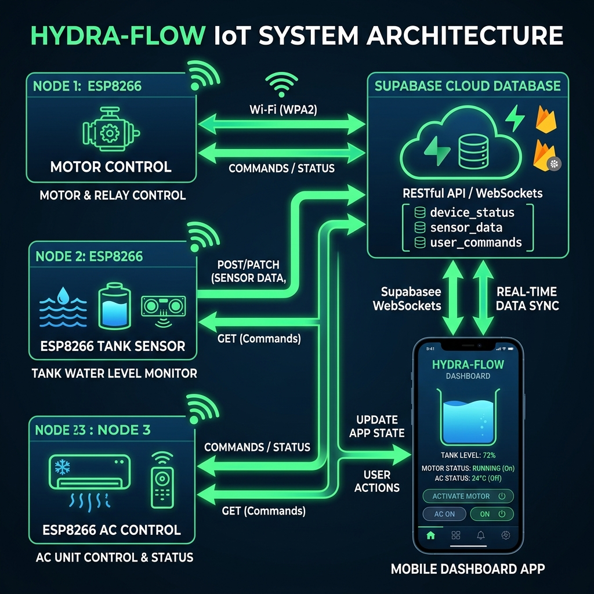
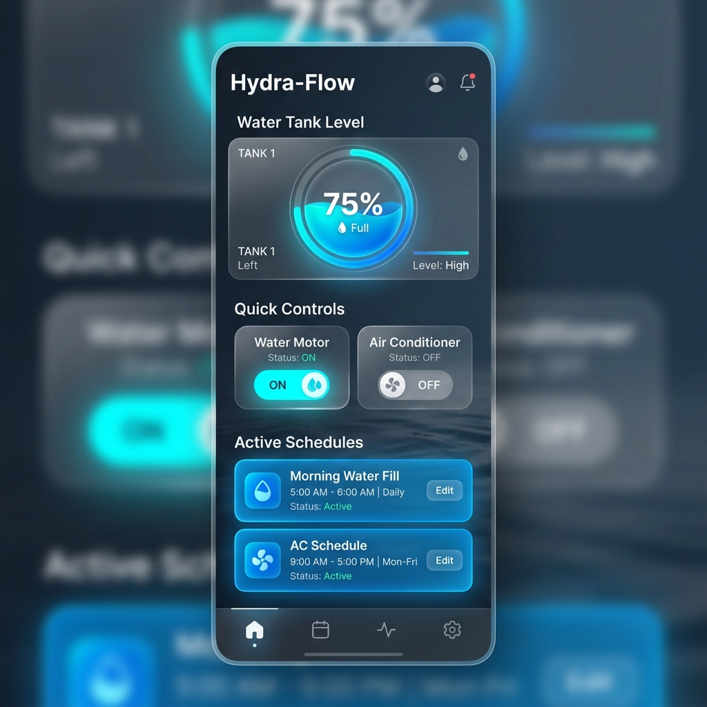
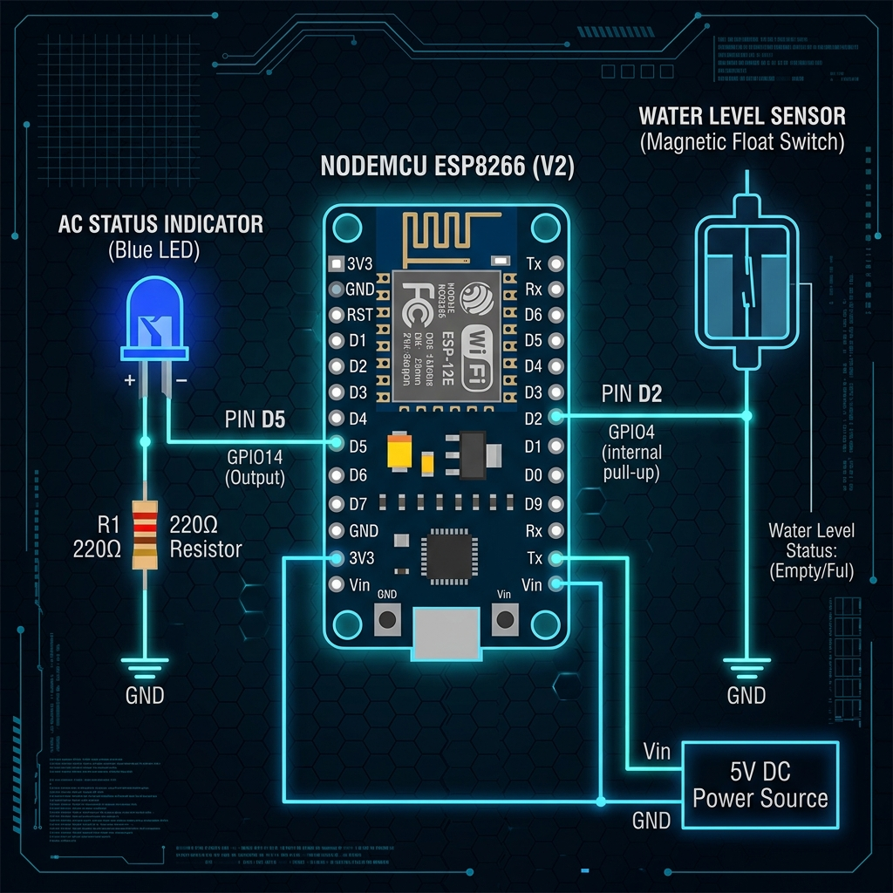
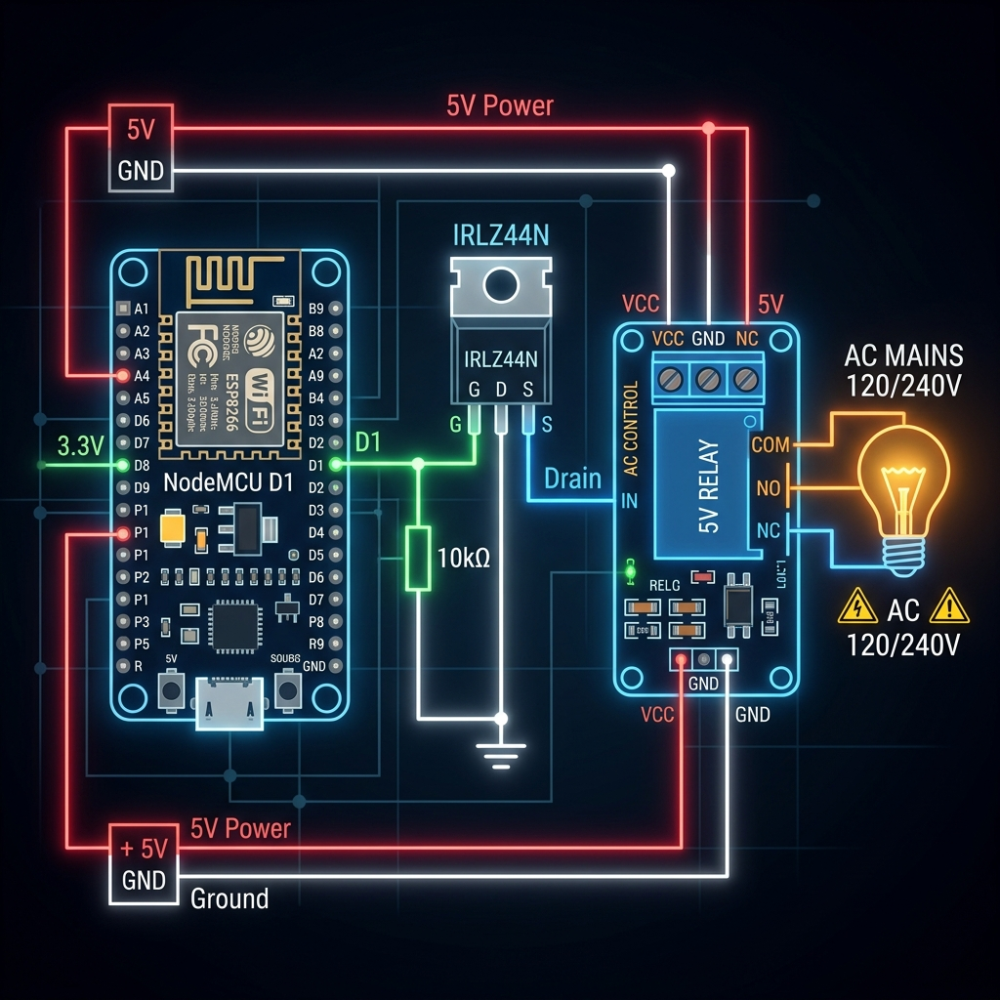

# Hydra-Flow 🌊 | Smart Water & Climate Management



[](https://opensource.org/licenses/ISC)
[](https://capacitorjs.com/)
[](https://www.espressif.com/en/products/socs/esp8266)
[](https://supabase.com/)

**Hydra-Flow** is a premium IoT ecosystem designed for sophisticated home automation. It manages water levels, motor operations, and climate control (AC) through a unified, real-time dashboard. Built with **ESP8266** nodes and powered by **Supabase**, Hydra-Flow ensures your home stays efficient and connected.

---

## 📱 The Dashboard
Experience a modern, glassmorphism-inspired interface that works seamlessly on Web, Android, and iOS.



### Core Features:
- **Real-Time Sync**: Instant updates on tank levels and device states.
- **Smart Scheduling**: Set up to 10 automated tasks for any node.
- **Visual Feedback**: Hardware LEDs sync with software states.
- **Safety Interlocks**: Automatic motor cutoff to prevent dry running or overflow.
- **Offline Reliability**: Built-in web servers on nodes for local emergency control.

---

## 🏗️ System Architecture
Hydra-Flow uses a distributed architecture where multiple specialized nodes communicate through a central cloud database.

- **Motor Control Node**: Manages the water pump with safety timers.
- **Tank Sensor Node**: Monitors water levels and provides local status LEDs.
- **AC Control Node**: Intelligent climate control with MOSFET-driven relays.
- **Cloud Backend**: Supabase handles real-time data flow and database triggers.
- **Client App**: Cross-platform Capacitor app for ultimate control.

---

## 🔧 Hardware Connection Guide

### 1. Motor Control Node
Connect your NodeMCU to a high-quality relay to control the water pump safely.
- **Signal**: NodeMCU `D1` → Relay `IN`
- **Safety**: Includes a 30-minute hardcoded safety timer.

### 2. Tank Sensor & AC Indicator
This node monitors the water level and provides visual feedback for the AC system.

- **Sensor**: NodeMCU `D2` → Magnetic Float Switch (Wire 1), `GND` → (Wire 2)
- **Feedback**: NodeMCU `D5` → Blue LED (+) → 220Ω Resistor → `GND`

### 3. AC Control Node (High Stability)
Uses a MOSFET driver for precise relay control and improved longevity.

- **Signal**: NodeMCU `D1` → IRLZ44N MOSFET Gate (with 10k Pull-down)
- **Driver**: MOSFET switches the Relay ground for high-speed, reliable toggling.

---

## 🚀 Software Setup Guide

### 1. Database (Supabase)
1. Create a project on [Supabase](https://supabase.com/).
2. Run `master_setup.sql` in the SQL Editor to initialize tables and triggers.
3. Enable **Realtime** for the `motor_system` table.

### 2. Firmware (Arduino)
1. Open the `.ino` files in Arduino IDE.
2. Install required libraries: `ESP8266WiFi`, `ESP8266HTTPClient`, `ArduinoJson`.
3. Update `config.h` (or credentials section) with your WiFi and Supabase details.
4. Upload to the respective ESP8266 boards.

### 3. Frontend (Web/Mobile)
1. Install Node.js dependencies:
   ```bash
   npm install
   ```
2. Update Supabase URL/Key in `www/script.js`.
3. To run the web dashboard:
   ```bash
   npx serve www
   ```
4. To build for Android:
   ```bash
   npx cap sync
   npx cap open android
   ```

---

## 📜 Project Structure
```text
├── motor_control.ino       # Pump control firmware
├── ac_control.ino          # Climate control firmware
├── tank_sensor.ino         # Level sensing & indicator firmware
├── www/                    # Dashboard frontend (HTML/CSS/JS)
├── android/                # Native Android wrapper
├── assets/diagrams/        # High-quality circuit & arch diagrams
├── master_setup.sql        # Database initialization script
└── capacitor.config.json   # Mobile app configuration
```

---

## 🛡️ License
Distributed under the **ISC License**. See `LICENSE` for more information.

Developed with ❤️ by **Issac Moses**
