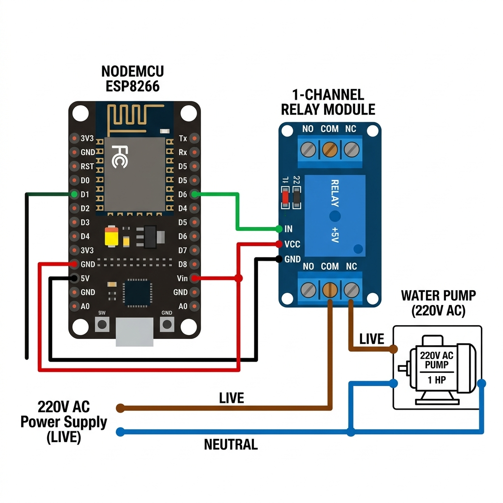

# Hydra-Flow 🌊

[](https://opensource.org/licenses/ISC)
[](https://capacitorjs.com/)
[](https://www.espressif.com/en/products/socs/esp8266)

**Hydra-Flow** is a comprehensive IoT ecosystem designed for smart water management. It combines ESP8266-based hardware nodes for motor control and water level sensing with a modern Capacitor-powered mobile/web dashboard and a Supabase backend for real-time synchronization.

---

## 🚀 Key Features

- **Real-Time Monitoring**: Instant updates on water levels and motor status via Supabase.
- **Remote Motor Control**: Toggle your water motor from anywhere in the world.
- **Multi-Schedule Support**: Set up to 10 daily schedules for automatic motor operation.
- **Intelligent Tank Sensing**: Stable, anti-flicker logic for accurate water level reporting.
- **Local Control Interface**: Integrated web server for direct control even when the internet is down.
- **Safety First**: Hardcoded 30-minute safety timer to prevent motor burnout.
- **Heartbeat Tracking**: Visual indicators for node connectivity status.

## 🛠️ Technology Stack

- **Hardware**: ESP8266 (NodeMCU), Float Switch Sensors, Relay Modules.
- **Frontend**: HTML5, CSS3, JavaScript (Vanilla), Capacitor (for Mobile).
- **Backend/DB**: Supabase (PostgreSQL + Real-time).
- **Firmware**: Arduino/C++.

---

## 📦 Project Structure

```text
├── motor_control.ino       # ESP8266 Firmware for Motor Node
├── tank_sensor.ino         # ESP8266 Firmware for Tank Level Node
├── www/                    # Mobile/Web Frontend Assets
│   ├── index.html          # Main Dashboard UI
│   ├── script.js           # Frontend Logic & Supabase Integration
│   └── style.css           # Modern Glassmorphism Styles
├── android/                # Capacitor Android Project
├── database.sql            # Supabase Schema Definitions
└── capacitor.config.json   # Capacitor Configuration
```

---

## 🔧 Installation & Setup

### 1. Database Setup (Supabase)
1. Create a new project on [Supabase](https://supabase.com/).
2. Run the queries in `database.sql` in the SQL Editor to set up the `motor_system` and `motor_schedules` tables.
3. Obtain your `URL` and `Anon Key`.

### 2. Firmware Configuration
1. Open `motor_control.ino` and `tank_sensor.ino` in the Arduino IDE.
2. Update the `ssid`, `password`, `supabaseUrl`, and `anonKey` with your credentials.
3. Flash the code to your respective ESP8266 nodes.

### 3. Frontend Setup
1. Clone the repository.
2. Install dependencies:
   ```bash
   npm install
   ```
3. Update your Supabase config in `www/script.js`.
4. Run locally:
   ```bash
   npx serve www
   ```

### 4. Mobile Build (Optional)
```bash
npx cap sync
npx cap open android
```

---

## 🔌 Circuit Diagrams (Hardware Setup)

Making it easy to connect your hardware! Follow these visual guides to set up your NodeMCU nodes.

### 1. Motor Control Node
Connect your NodeMCU to a 1-channel relay to control the water pump.


*   **Pin Connection**: NodeMCU `D1` → Relay `IN`.
*   **Power**: NodeMCU `5V` → Relay `VCC`, NodeMCU `GND` → Relay `GND`.

### 2. Water Tank Level Sensor
Connect your NodeMCU to a magnetic float switch for level detection.


*   **Pin Connection**: NodeMCU `D2` → Float Switch (Wire 1).
*   **Ground**: NodeMCU `GND` → Float Switch (Wire 2).
*   **Logic**: No external resistor needed if using internal pull-up (configured in `tank_sensor.ino`).

---

## 🛡️ Hardware Pinout Summary

- **Motor Node**: Relay Signal connected to `D1`.
- **Level Node**: Float switch connected to `D2`.

---

## 📄 License

This project is licensed under the ISC License.

Developed with ❤️ by [Issac Moses](https://github.com/Issac-Moses)
